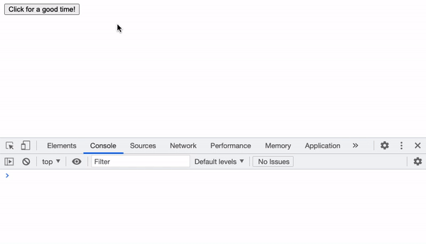

This package is a lightweight promisified reimplementation of the JavaScript `confirm()`. It uses a `<dialog>` element ([with a polyfill](https://github.com/GoogleChrome/dialog-polyfill)) under the hood and not a lot else.

Instead of blocking code execution, this dialog returns a promise that resolves with a boolean of the answer.

[Check out a demo!](https://outtherenz.github.io/html-js-confirm/demo.html)



### But why?
Mostly because of [cross-origin iframes and browser support](https://www.chromestatus.com/feature/5148698084376576). In Chrome 92+ `confirm()` cannot be triggered from an `<iframe>` when the frame is cross-origin. This implementation is HTML and JavaScript and will not be blocked.

## Usage

### Installation

```bash
npm install html-js-confirm
```

There are several ways to include the module:
- `import` (ESM module)
- `require` (CJS)
- Include the `dist/html-js-confirm.min.js` in your HTML, which overwrites the JavaScript `confirm()` and replaces it with this implementation.

```javascript
// direct import
import confirm from './node_modules/html-js-confirm/dist/html-js-confirm.esm.js';

// modern es modules with rollup/webpack bundlers and node via esm module
import confirm from 'html-js-confirm';

// traditional commonjs/node and browserify bundler
const confirm = require('html-js-confirm');
```

Don't forget to include the `dist/html-js-confirm.css` in your HTML for the `<dialog>` polyfill to work.

### JS example
```javascript
// using async await
async () => {
  if (await confirm('Are you sure you want to continue?')) {
    // we continue
  } else {
    // we cancel
  }
}

// using then
function() {
  return confirm('Are you sure you want to continue?')
    .then(continue => {
      if (continue) {
        // we continue
      } else {
        // we cancel
      }
    });
}
```

### HTML example
```html
<head>
  <link rel="stylesheet" type="text/css" href="dist/html-js-confirm.css" />
</head>
<body>
  <button type="button" id="good-time-button">
    Click for a good time!
  </button>

  <script type="text/javascript" src="dist/html-js-confirm.min.js"></script>
  <script>
    const button = document.getElementById('good-time-button');

    button.addEventListener('click', async () => {
      if (await confirm('Are you sure you want to have a good time?')) {
        console.log('🎉');
      } else {
        console.log('No party for you');
      }
    });
  </script>
</body>
```

### Further reading
The `<dialog>` polyfill included with this package can be found [here](https://github.com/GoogleChrome/dialog-polyfill). If you are relying on the polyfill, you should read up on its limitations.